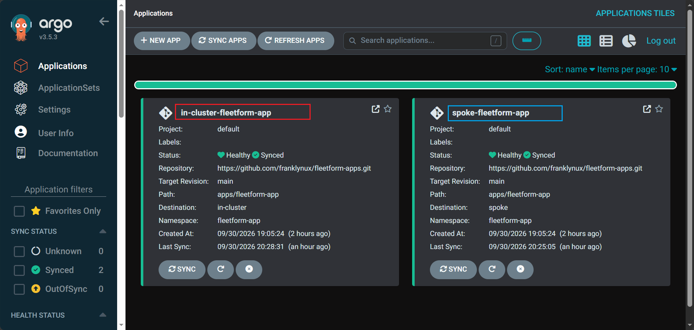
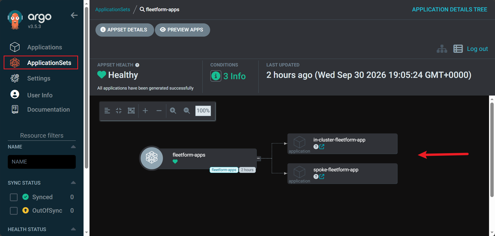
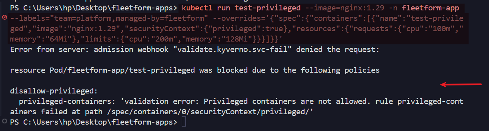
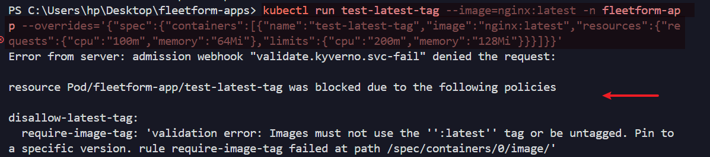
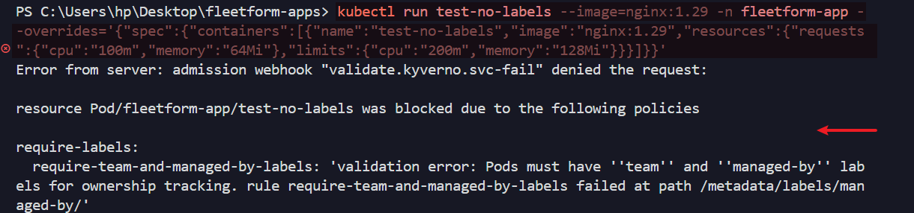
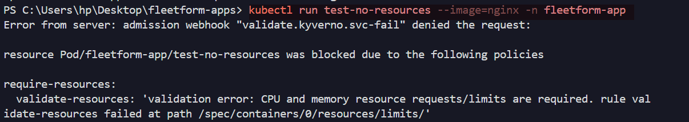
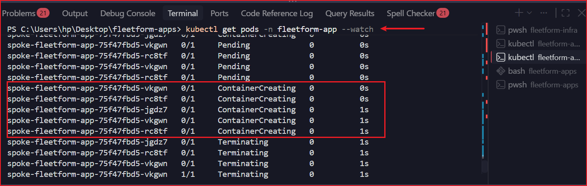
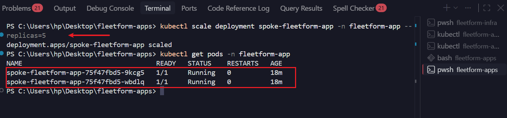

# Fleetform

Multi-cluster GitOps self-service platform on AWS EKS. Argo CD ApplicationSets
drive automated app delivery across a hub-spoke cluster topology, with Kyverno
enforcing security and hygiene guardrails at admission time.


## What this proves

- **Self-service onboarding**: a new app is added by dropping a folder into
  `apps/`, not by anyone touching Argo CD directly
- **Multi-cluster delivery from one source of truth**: one `ApplicationSet`
  (cluster generator) targets every registered cluster automatically —
  no per-cluster manifests to hand-maintain
- **Layered configuration**: repo-wide defaults → per-app defaults →
  per-cluster overrides, merged via Helm value layering
- **GitOps self-healing**: manual cluster drift (e.g. `kubectl scale`) is
  automatically reverted to match git — demonstrated live during development
- **Policy-as-code guardrails**: four Kyverno `ClusterPolicy` rules block
  non-compliant workloads at admission time, before they ever run

## Architecture

- **Hub cluster** — runs Argo CD, the ApplicationSet controller, and Kyverno.
  Acts as the control plane for the whole fleet.
- **Spoke cluster** — registered to hub via `argocd cluster add`; runs
  workloads and its own Kyverno install for local enforcement.
- **This repo** — what Argo CD polls. Infra provisioning lives in a separate
  repo, [`fleetform-infra`](https://github.com/franklynux/fleetform-infra),
  deliberately kept apart so Argo CD never has visibility into Terraform state
  or cloud credentials.

  fleetform-apps/
├── values.yaml # repo-wide defaults (labels, annotations)
├── apps/
│ └── fleetform-app/
│ ├── Chart.yaml
│ ├── templates/
│ ├── base/values.yaml # app defaults
│ └── overlays/
│ ├── in-cluster/values.yaml # hub-specific overrides
│ └── spoke/values.yaml # spoke-specific overrides
└── platform/
├── argocd/
│ ├── values.yaml # Argo CD Helm install config
│ └── applicationsets/
│ └── fleetform-app.yaml # the cluster-generator ApplicationSet
└── kyverno/
└── policies/
├── require-resources.yaml
├── disallow-latest-tag.yaml
├── require-labels.yaml
└── disallow-privileged.yaml

## Fleet view





Both clusters show `Synced` / `Healthy` status, driven entirely from the
single `ApplicationSet` — no manual per-cluster configuration.

## How a new app gets onboarded

1. Copy `apps/fleetform-app/` as a template into a new folder under `apps/`
2. Set `base/values.yaml` for app-wide defaults
3. Set `overlays/<cluster-name>/values.yaml` for anything cluster-specific
4. Open a PR — no direct `argocd` or `kubectl` access required
5. On merge, the `ApplicationSet`'s cluster generator picks it up automatically
   and deploys it to every matched cluster

Value files are layered in this order (later overrides earlier):
../../values.yaml → repo-wide defaults
base/values.yaml → app defaults
overlays/{{cluster}}/values.yaml → cluster-specific

## Guardrails (Kyverno)

| Policy | Enforces |
|---|---|
| `require-resources` | Every pod must set CPU/memory requests and limits |
| `disallow-latest-tag` | Images must be pinned to a specific tag, not `:latest` |
| `require-labels` | Every pod must carry `team` and `managed-by` labels for ownership tracking |
| `disallow-privileged` | Privileged containers are rejected outright |

All four are set to `validationFailureAction: Enforce` — violations are
blocked at admission, not just logged.









## GitOps self-healing, demonstrated

To confirm Argo CD enforces git as the actual source of truth (not just an
initial deploy mechanism), the spoke app was manually scaled out-of-band:

```bash
kubectl scale deployment spoke-fleetform-app -n fleetform-app --replicas=5
```

Argo CD's `selfHeal` reverted this back to the 2 replicas declared in
`overlays/spoke/values.yaml` within seconds, with no manual intervention.





## Tech

Terraform · AWS EKS · Argo CD (ApplicationSets, cluster generator) · Helm ·
Kyverno · GitOps

## What I'd change for production

- Scope Kyverno policies with `Audit` mode first, promoting to `Enforce`
  gradually per team, rather than enforcing from day one
- Replace `cluster-admin` on the spoke's `argocd-manager` ServiceAccount with
  a scoped role limited to the namespaces Argo CD actually manages
- Separate `AppProject`s per team instead of the shared `default` project,
  to restrict which repos/clusters/namespaces each team can target
- One NAT gateway per AZ instead of one per VPC, for availability